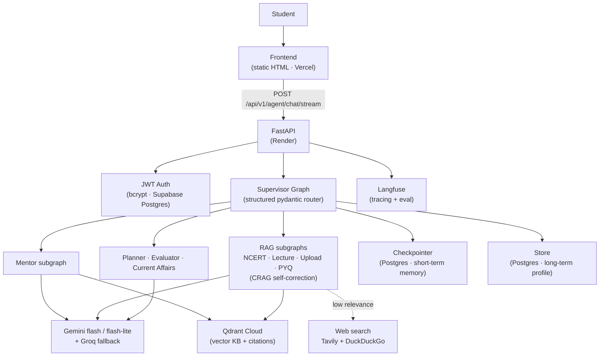

# 🧠 UPSC AI — Honest AI Study Partner

A production-grade **multi-agent AI system** for UPSC aspirants — strategy, doubt-clearing, current affairs, PYQ practice, and mains answer evaluation — built on **LangGraph** with a strict **no-hallucination (grounded + cited)** design.

> **Live demo**
> - 🌐 Frontend: https://upsc-agentic-ai.vercel.app
> - ⚙️ API: https://upsc-agentic-ai.onrender.com
> - 📖 API docs (Swagger): https://upsc-agentic-ai.onrender.com/docs
>
> ⚠️ The backend runs on a free tier and sleeps when idle — the **first request may take ~30–50s** to warm up.

---

## ✨ Features

Eight specialised agents, orchestrated by a single **supervisor graph**:

| Agent | What it does |
|---|---|
| 🧭 **Mentor** | Strategy, doubt-clearing, roadmaps |
| 📚 **NCERT / Subject RAG** | Grounded answers from indexed NCERT & GS material |
| 📰 **Current Affairs** | Live, web-grounded updates |
| 📝 **PYQ** | Previous-year-question practice |
| 🎥 **Lecture** | Q&A over lecture transcripts |
| 📤 **Upload** | Chat over the student's own uploaded notes/PDFs |
| 🗓️ **Planner** | Personalised study plans |
| ✍️ **Evaluator** | Mains answer evaluation (strengths → gaps → fixes) |

**Highlights**

- 🎯 **No hallucination by design** — every academic answer is grounded in a vector knowledge base with citations; volatile facts (exam dates, cut-offs) are flagged to verify at `upsc.gov.in`.
- ⚡ **Token-level streaming chat** — live-typing UX via a single unified endpoint.
- 🧠 **Persistent memory** — short-term (per-conversation) + long-term (student profile) across sessions.
- 🔁 **Self-correcting RAG (CRAG)** — grades retrieved context and falls back to web search when it is weak.
- 🛡️ **Resilient LLM layer** — Gemini (flash / flash-lite) with Groq fallback.

---

## 🏗️ Architecture



### How a request flows

1. The frontend sends the user message to **`POST /api/v1/agent/chat/stream`** (JWT-authenticated).
2. The **supervisor** classifies intent with a structured pydantic router and dispatches to the right subgraph.
3. The subgraph runs its nodes — e.g. **Mentor**: `router → retrieve_kb → (web_search?) → generate`; **RAG**: `retrieve → grade → (web_search?) → generate` (CRAG).
4. The final answer is **streamed token-by-token**; only final-answer nodes are emitted (internal routing/grading never leaks).
5. Conversation state is persisted via the **Postgres checkpointer**; the student profile via the **long-term store**. **Langfuse** traces everything.

---

## 🧩 LangGraph design

- **Shared state** — a single `AgentState` (`TypedDict`, `add_messages`) flows through every node.
- **Supervisor** — hierarchical router; subgraphs are nested as nodes (`mentor`, `rag`, `planner`, `evaluator`, `current_affairs`).
- **RAG factory** — one `build_rag_subgraph()` powers NCERT / Lecture / Upload / PYQ.
- **CRAG** — a grade node measures retrieval relevance; weak context triggers a web-search fallback before generation.
- **Memory** — `langgraph-checkpoint-postgres` (`PostgresSaver` for short-term, `PostgresStore` for the long-term student profile), reusing the same Supabase `DATABASE_URL`.
- **Structured routing** — replaced brittle regex intent detection with a pydantic structured-output LLM that also decides `needs_web_search`.

---

## 🛠️ Tech stack

| Layer | Tech |
|---|---|
| Orchestration | **LangGraph** + LangChain |
| API | **FastAPI** (prefix `/api/v1`) |
| LLMs | **Gemini** flash / flash-lite, **Groq** fallback |
| Vector store | **Qdrant Cloud** (cosine, Gemini embeddings) |
| Memory + DB | **Supabase Postgres** (checkpointer + store + auth) |
| Auth | Custom **JWT** + bcrypt |
| Web search | **Tavily** + DuckDuckGo |
| Observability + eval | **Langfuse** + LLM-as-judge faithfulness gate |
| Frontend | Static **HTML** (token-streaming chat) |
| Hosting | **Render** (API) + **Vercel** (frontend) |
| Tooling | **uv** (deps), Python |

---

## 📁 Project structure

```text
src/
├── api/              # FastAPI app, routes, deps
│   └── routes/       # auth, agent chat (+ /agent/chat/stream), form-agent routes
├── graph/            # LangGraph layer (the multi-agent core)
│   ├── state.py          # shared AgentState
│   ├── supervisor.py     # hierarchical router
│   ├── mentor_graph.py   # mentor subgraph (structured router + KB + web)
│   ├── rag_graph.py      # CRAG RAG-subgraph factory
│   ├── agent_subgraphs.py# planner / evaluator / current affairs
│   ├── memory.py         # Postgres checkpointer + long-term store
│   └── app_graph.py      # production entrypoint (supervisor + memory + Langfuse)
├── agents/           # business logic + prompts (reused inside subgraphs)
├── core/             # llm, vector_store, mentor_kb, config, observability
└── models/           # SQLAlchemy models
upsc-frontend/        # static HTML frontend (deployed to Vercel)
eval/                 # LLM-as-judge eval suite + dataset
render.yaml           # Render blueprint
```

---

## 🚀 Local setup

```bash
# 1. Install uv (https://docs.astral.sh/uv/)
pip install uv

# 2. Install dependencies
uv sync

# 3. Configure environment
cp .env.example .env   # then fill in your keys (see below)

# 4. Run the API
uv run uvicorn src.api.main:app --reload
```

Visit `http://localhost:8000/docs` for the interactive API.

### Environment variables

```bash
# LLM
GOOGLE_API_KEY=...
GROQ_API_KEY=...
ENABLE_PROVIDER_FALLBACK=true

# Database (Supabase Postgres — auth + memory)
DATABASE_URL=postgresql://...pooler.supabase.com:5432/postgres?sslmode=require
JWT_SECRET=...                 # generate: python -c "import secrets; print(secrets.token_urlsafe(48))"
REQUIRE_EMAIL_VERIFICATION=true

# Vector store (Qdrant Cloud)
QDRANT_URL=https://<cluster>.cloud.qdrant.io:6333
QDRANT_API_KEY=...
SIMILARITY_THRESHOLD=0.3

# Web search
TAVILY_API_KEY=...

# Observability
LANGFUSE_PUBLIC_KEY=...
LANGFUSE_SECRET_KEY=...
LANGFUSE_HOST=https://cloud.langfuse.com

# CORS (lock to your frontend origin in production)
CORS_ORIGINS=["https://upsc-agentic-ai.vercel.app"]
```

---

## ☁️ Deployment

- **Backend → Render** (`render.yaml`): `pip install uv && uv sync --frozen` build, `uv run uvicorn src.api.main:app --host 0.0.0.0 --port $PORT` start, health check at `/health`.
- **Frontend → Vercel**: static deploy of `upsc-frontend/` (Framework: *Other*, Root Directory: `upsc-frontend`).
- **Vectors → Qdrant Cloud**: durable, restart-safe (Render free tier has no persistent disk).
- **CORS** is locked to the Vercel origin in production.

---

## 🔒 Security

- Self-managed JWT auth (bcrypt-hashed passwords) on Supabase Postgres.
- Secrets are environment-only; `.env` is git-ignored and `.env.example` ships placeholders.
- Rotate all keys before production use.

---

## 🗺️ Roadmap

- [ ] Multi-thread chat UI ("New chat" + history)
- [ ] Semantic caching for repeat queries
- [ ] SLM cost-routing (cheap models for easy tasks)
- [ ] Cloudflare WAF + rate limiting

---

*Built to be honest: it would rather say "verify at upsc.gov.in" than invent a date.*
