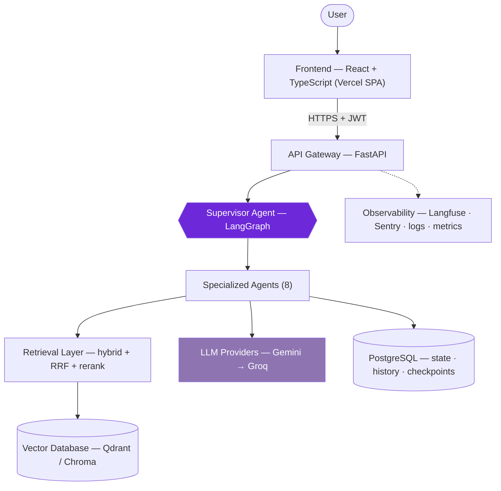
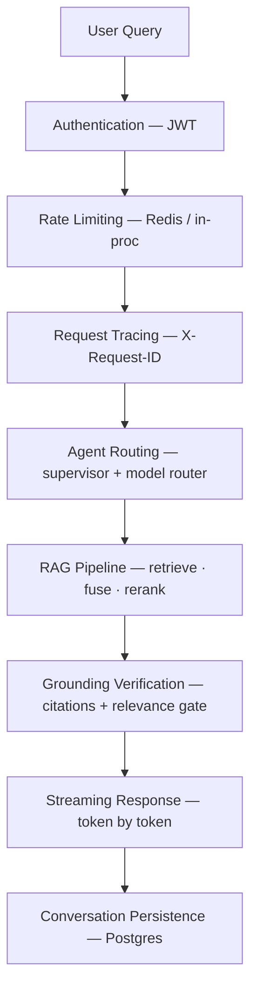
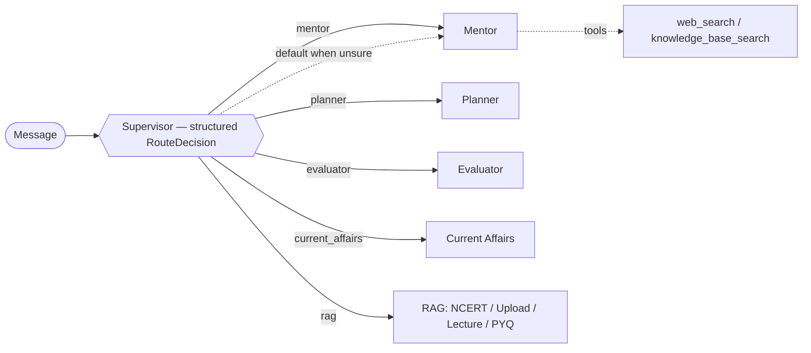
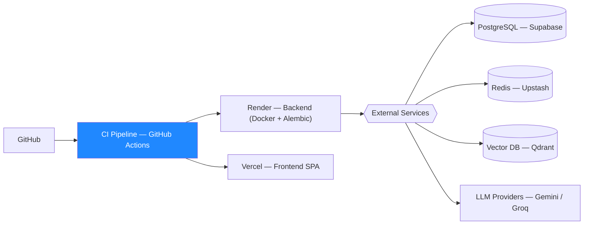

# UPSC Agentic AI

**A production-grade, retrieval-grounded multi-agent AI system for UPSC preparation.**

Designed, built, deployed, and operated end to end — FastAPI + LangGraph backend, React/TypeScript frontend, hybrid RAG, and a reliability layer built for real free-tier constraints.

-blue?style=flat-square)

> **Reviewer TL;DR** — 8 specialised agents behind one LangGraph supervisor; hybrid retrieval (dense + lexical) with RRF fusion, cross-encoder reranking, and citation-enforced grounding; DB-persisted background jobs; circuit breakers, distributed rate limiting, request tracing; provider fallback (Gemini → Groq); 206 offline tests + an LLM-as-judge faithfulness gate in CI. Every external dependency **fails open**, so the app degrades instead of crashing.

---

## Table of Contents
1. [Problem Statement](#1-problem-statement)
2. [System Design](#2-system-design)
3. [Engineering Decisions](#3-engineering-decisions)
4. [Production Features](#4-production-features)
5. [Performance & Reliability Metrics](#5-performance--reliability-metrics)
6. [Failures & Lessons Learned](#failures--lessons-learned)
7. [Screenshots](#screenshots)
8. [For Reviewers & Recruiters](#6-for-reviewers--recruiters)

---

## 1. Problem Statement

**User problem.** UPSC preparation runs for years over a huge, fragmented syllabus (NCERTs, standard texts, daily current affairs, previous-year questions) and demands constant answer-writing practice with objective feedback. Aspirants stitch together PDFs, coaching notes, lectures, a separate planner, and have no trustworthy way to get *grounded*, syllabus-aware answers.

**Why existing solutions fail.**

| Approach | Why it falls short |
|---|---|
| Generic chatbots | Confidently invent article numbers, committees, dates — fatal for a precision exam |
| Static note apps / PDFs | No synthesis, no feedback loop, no retrieval |
| Single-prompt LLM wrappers | No grounding, no citations, no task specialisation, brittle under load |

**Why an LLM alone is insufficient.**
- **Stale + hallucinated facts** — training data is dated; exam dates, notifications, and cut-offs must come from live sources, not model memory.
- **No verifiability** — a serious aspirant needs to see *where* an answer came from.
- **One prompt can’t do everything** — grading a mains answer, building a timetable, and answering an NCERT question need different prompts, tools, and output contracts.

**Why agents + retrieval are required.**
- **Retrieval (RAG)** grounds answers in real source text and attaches citations, so claims are checkable and the model is constrained to the corpus.
- **Agents** give each task its own pipeline, tools, and validated output schema; a **supervisor** routes each request to the right specialist and can call **tools** (web search, knowledge base) only when needed — keeping trivial turns cheap and factual turns grounded.

---

## 2. System Design

### High-Level Architecture

```mermaid
flowchart TD
    U([User]) --> FE["Frontend — React + TypeScript (Vercel SPA)"]
    FE -->|HTTPS + JWT| GW["API Gateway — FastAPI"]
    GW --> SUP{{"Supervisor Agent — LangGraph"}}
    SUP --> AG["Specialized Agents (8)"]
    AG --> RET["Retrieval Layer — hybrid + RRF + rerank"]
    RET --> VDB[("Vector Database — Qdrant / Chroma")]
    AG --> LLM["LLM Providers — Gemini → Groq"]
    GW -.-> OBS["Observability — Langfuse · Sentry · logs · metrics"]
    AG --> PG[("PostgreSQL — state · history · checkpoints")]
    style SUP fill:#6D28D9,color:#fff
    style LLM fill:#8E75B2,color:#fff
```

### Request Flow

```mermaid
flowchart TD
    A[User Query] --> B[Authentication — JWT]
    B --> C[Rate Limiting — Redis / in-proc]
    C --> D[Request Tracing — X-Request-ID]
    D --> E[Agent Routing — supervisor + model router]
    E --> F[RAG Pipeline — retrieve · fuse · rerank]
    F --> G[Grounding Verification — citations + relevance gate]
    G --> H[Streaming Response — token by token]
    H --> I[Conversation Persistence — Postgres]
```

Middleware order is deliberate (outermost → innermost): `RequestId → HttpMetrics → MaxUploadSize → RateLimit → Timeout(90s) → SecurityHeaders → CORS`. Request-ID is outermost so **every** inner log line and the response carry the same correlation ID.

### RAG Architecture

| Stage | Implementation | Tradeoff |
|---|---|---|
| **Ingestion** | PDFs parsed with `pypdf`; current-affairs/NCERT/mentor KB ingested via `scripts/ingest_*.py` and agent ingest modules | Simple + dependency-light; no OCR (scanned PDFs unsupported) |
| **Chunking** | `RecursiveCharacterTextSplitter` (LangChain) — recursive separators preserve semantic boundaries | Fixed-size windows can still split mid-argument; no semantic chunker (added latency not justified yet) |
| **Embeddings** | Google `gemini-embedding-001`, **pinned to 768 dims** via a Matryoshka-truncate + L2-normalize wrapper | Managed API = no local GPU/OOM on 512 MB tiers; costs an API call per embed |
| **Vector indexing** | Qdrant collection per `persist_key`; **local Chroma fallback** when `QDRANT_URL` unset | Stateless prod (no disk) vs. a managed dependency; fallback keeps dev offline-friendly |
| **Retrieval** | Two arms — **dense** (vector similarity) + **lexical** (concept-coverage with curated UPSC abbreviation expansion) | Lexical arm adds recall for exact terms without diluting exact matches |
| **Fusion** | **Reciprocal Rank Fusion** (`1/(k+rank)`) instead of a linear score blend | Scale-independent + robust; loses absolute-score magnitude information |
| **Re-ranking** | Concept-coverage rerank; optional local **cross-encoder** rerank (cached) | Cross-encoder improves precision but is heavy to load — opt-in |
| **Context compression** | Similarity threshold (`SIMILARITY_THRESHOLD`, default 0.3; mentor KB 0.25) drops weak chunks before compose | Fewer tokens + less noise vs. risk of dropping a borderline-relevant chunk |
| **Hallucination prevention** | Citation enforcement in `grounding.compose_grounded_answer`, a **relevance gate** that refuses off-syllabus answers, and tool prompts that forbid guessing time-sensitive facts | Occasionally refuses a valid-but-thinly-retrieved query (precision over recall by design) |

> **HyDE** (`generate_hypothetical_document`) and **multi-query expansion** (`expand_queries`) exist in `retrieval.py` as opt-in upgrades; they add per-query LLM latency/cost and are gated behind the nightly eval harness rather than always-on.

### Multi-Agent Architecture

```mermaid
flowchart LR
    Q([Message]) --> S{{Supervisor — structured RouteDecision}}
    S -->|mentor| M[Mentor]
    S -->|planner| P[Planner]
    S -->|evaluator| E[Evaluator]
    S -->|current_affairs| C[Current Affairs]
    S -->|rag| R[RAG: NCERT / Upload / Lecture / PYQ]
    M -.tools.-> T[web_search / knowledge_base_search]
    S -.default when unsure.-> M
```

- **Supervisor pattern.** A single LLM call returns a **structured `RouteDecision`** (Pydantic `Literal` over 5 routes). All subgraphs share one `AgentState`; only the supervisor is compiled with the checkpointer/store, so nested agents inherit memory. Callers may force a route by pre-setting `state['route']` when the UI already knows the target.
- **Agent routing.** Classify → dispatch to one specialist. Default to **mentor** when unsure (safe fallback). Complex mentor turns can escalate to a **plan-execute** graph (`is_complex`).
- **Tool calling.** A ReAct-style loop (`build_tool_agent`) gives the *model* real tools (`web_search`, `knowledge_base_search`) and decides when/how to call them. Tool dispatch is a **pure, offline-tested function** isolated from the LLM.
- **Agent communication.** Via shared typed state — no ad-hoc message passing; structured params flow through `state['task_inputs']`, RAG adds `state['persist_key']`.
- **Failure recovery & retries.** Tool loop capped at `DEFAULT_MAX_TOOL_LOOPS = 3` (no infinite tool spirals); KB is a *bonus not a gate* — if retrieval returns nothing, the agent still answers timeless questions and only refuses on time-sensitive facts; provider fallback + `tenacity` retries wrap flaky LLM calls.

### Background Processing Design

- **Why it exists.** PDF/lecture processing is slow; on a single free-tier worker it would block the request path and trip the 90s timeout. Jobs move that work off-request.
- **Lifecycle.** `POST /upload/process` → enqueue → return `job_id` immediately → thread-pool worker executes → status + result persisted in Postgres → client polls `GET /jobs/{id}` until `done`/`error`.
- **Queue architecture.** DB-persisted, thread-backed (`ThreadPoolExecutor`), **no external broker** — status survives process restarts. Backend is selectable: `thread` / `inline` (tests) / `auto`.
- **Retry & failure handling.** On boot, `reap_stale_jobs` flips orphaned `queued`/`running` rows to `error`, so a client never polls a dead job forever — a definitive answer beats a stuck spinner.

### Scalability Design

- **Stateless API.** No in-process session state; vectors live in Qdrant, all user/auth/history/checkpoint state in Postgres — so instances are interchangeable.
- **Horizontal scaling.** Because it’s stateless, add workers/instances freely (`WEB_CONCURRENCY`); tune per plan.
- **Redis rate limiting.** Upstash fixed-window counter is shared across instances (a per-process limiter would under-count behind a load balancer).
- **Caching.** Two-stage response cache (exact SHA-256 key + optional embedding-similarity match), **scoped per conversation** so a cached answer never leaks across users/threads.
- **Database scaling.** Pooled Postgres (`psycopg-pool`, Supabase/Neon 6543 pooler); SQLite only for local/tests. Cache + LITE routing cut load before it reaches the DB/LLM.

### Reliability Design

- **Circuit breakers.** Dependency-free breaker (CLOSED → OPEN → HALF_OPEN) wraps flaky upstreams (e.g. Redis REST): after N consecutive failures it fails fast for a cooldown, then probes once before closing. Prevents retry storms.
- **Provider fallback.** Gemini primary → Groq on 429/outage (`ENABLE_PROVIDER_FALLBACK`).
- **Timeout strategy.** Hard 90s per-request timeout so one stuck LLM/vector call can’t pin the single free-tier worker (= total outage without it).
- **Graceful degradation / fail-open.** Cache, Qdrant, Redis, Langfuse, Sentry, SMTP all degrade to a local/no-op fallback when unconfigured or failing — the core chat path never breaks because an optional dependency is down.
- **Error recovery.** Global exception handler returns a clean JSON envelope (never leaks a stack trace); stale-job reaping; startup token cleanup guarded so a DB hiccup can’t block boot.

### Observability Design

- **Structured logging** with request-scoped context (`logging_config.py`, `request_context.py`).
- **Request IDs** — inbound `X-Request-ID` honored or generated, threaded through every log line and returned on the response.
- **Tracing** — optional Langfuse traces on every LLM call (`observability.py`), flushed on shutdown.
- **Monitoring** — `HttpMetricsMiddleware` records latency/status/endpoint; an admin-only monitoring dashboard (`/monitoring`, `/cost`) surfaces them.
- **Alerting** — Sentry captures unhandled exceptions when `SENTRY_DSN` is set (no-op otherwise).

### Deployment Architecture

```mermaid
flowchart LR
    GH[GitHub] --> CI["CI Pipeline — GitHub Actions"]
    CI --> RB["Render — Backend (Docker + Alembic)"]
    CI --> VF["Vercel — Frontend SPA"]
    RB --> EXT{{External Services}}
    EXT --> PG[(PostgreSQL — Supabase)]
    EXT --> RD[(Redis — Upstash)]
    EXT --> QD[(Vector DB — Qdrant)]
    EXT --> LP[LLM Providers — Gemini / Groq]
    style CI fill:#2088FF,color:#fff
```

- **Backend (Render):** build `pip install uv && uv sync --frozen`; start `alembic upgrade head && uvicorn src.api.main:app --host 0.0.0.0 --port $PORT`; health `/health`; stateless → free plan, no disk.
- **Frontend (Vercel):** build `npm run build`; output `dist/`; SPA rewrites to `/index.html`.
- **Container:** multi-stage, non-root Dockerfile targeting `src.api.main:app`, migrations before boot, container health check on `/health`.

### Security Design

- **JWT authentication.** Short-lived signed access tokens (`python-jose`); every protected router depends on `get_current_user`.
- **Token refresh flow.** Refresh tokens are **opaque random strings stored only as SHA-256 hashes** (a DB leak can’t be replayed). Each refresh **rotates** the token (old one revoked, new issued) so stolen-token reuse is detectable; `/auth/logout` revokes server-side — something a bare stateless JWT cannot do.
- **Rate limiting.** Global per-IP limit + a stricter auth-endpoint limit (`10 / 300s`).
- **Secret management.** All secrets via env (`pydantic-settings`); `.env` git-ignored; Render Blueprint secrets are `sync: false`; sensitive values kept out of logs (`secret_utils.py`). CORS is an explicit allowlist.
- **Security headers + prompt safety.** Hardening headers on every response (relaxed CSP only on `/docs`); untrusted retrieved/uploaded text is sanitised + wrapped before reaching the model (`prompt_safety.py`); per-user ownership checks on history (`test_security_ownership.py`).

---

## 3. Engineering Decisions

<b>Why FastAPI?</b>

**Problem:** async I/O to LLMs/vector DBs + typed request/response contracts + auto docs. 
**Alternatives:** Flask (sync-first, manual validation), Django (heavy for an API-only service), Node/Express (would split the AI stack across languages). 
**Decision:** FastAPI + Pydantic v2. 
**Tradeoff:** Async correctness is on me (blocking calls must be offloaded); smaller ecosystem than Django for batteries-included features.

<b>Why LangGraph (not a bare agent loop / CrewAI)?</b>

**Problem:** deterministic, inspectable multi-agent control flow with shared memory + checkpointing. 
**Alternatives:** hand-rolled prompt chains (no state/checkpoint), CrewAI/AutoGen (more opinionated, harder to make deterministic and offline-testable). 
**Decision:** LangGraph supervisor + nested subgraphs over one shared `AgentState`, Postgres checkpointer. 
**Tradeoff:** learning curve + framework coupling; in return, resumable state and a routing graph I can unit-test.

<b>Why a supervisor architecture?</b>

**Problem:** one mega-prompt can’t grade answers, plan schedules, and do RAG well simultaneously. 
**Alternatives:** single prompt with mode flags (brittle), keyword routing (misses intent). 
**Decision:** LLM supervisor returns a structured `RouteDecision`; defaults to mentor when unsure. 
**Tradeoff:** one extra LLM hop per request (mitigated by using the cheap LITE model for routing).

<b>Why vector search + RRF (not linear hybrid)?</b>

**Problem:** grounding answers in source text; a linear blend of cosine + lexical scores was brittle across corpora. 
**Alternatives:** pure dense (misses exact terms), pure lexical (misses paraphrase), tuned linear weights (drift per corpus). 
**Decision:** dense + lexical arms fused by **Reciprocal Rank Fusion** (rank-based, scale-independent). 
**Tradeoff:** discards absolute-score magnitude; needs two rankings per query.

<b>Why Redis (Upstash)?</b>

**Problem:** rate limiting + response cache must be correct across multiple stateless instances. 
**Alternatives:** in-process counters (wrong behind a load balancer), a full self-hosted Redis (infra cost on free tier). 
**Decision:** Upstash Redis over REST (no extra server), wrapped in a circuit breaker, with an in-process fallback. 
**Tradeoff:** approximate limits during fallback; REST latency per op vs. running my own Redis.

<b>Why background workers?</b>

**Problem:** PDF/lecture processing exceeds a safe request budget on one worker. 
**Alternatives:** block the request (times out), Celery/RQ + broker (infra + cost). 
**Decision:** DB-persisted, thread-backed queue — zero extra infra, status survives restarts. 
**Tradeoff:** limited to in-process concurrency (fine for free tier); not a distributed broker.

<b>Why streaming responses?</b>

**Problem:** multi-second LLM generations feel broken if the UI waits for the full answer. 
**Alternatives:** block-and-return (poor UX), polling (complex). 
**Decision:** `StreamingResponse` (token-by-token) for chat routes; `/sync` variants return Pydantic-validated structured output for programmatic use. 
**Tradeoff:** streaming + strict output schemas don’t mix, hence two endpoint shapes to maintain.

---

## 4. Production Features

| Feature | Where | One-line proof |
|---|---|---|
| **Background workers** | `core/job_queue.py` | DB-persisted jobs, stale-job reaping on boot |
| **Circuit breakers** | `core/circuit_breaker.py` | CLOSED/OPEN/HALF_OPEN, thread-safe, fail-fast |
| **Distributed rate limiting** | `api/rate_limit_core.py` | Upstash window + in-proc sliding-window fallback |
| **Request tracing** | `api/request_id.py` | Correlation ID on every log line + response |
| **Structured logging** | `core/logging_config.py` | Request-scoped context formatters |
| **CI/CD** | `.github/workflows/ci.yml` | lint → compile → tests → build → nightly LLM-eval |
| **Error recovery** | `api/main.py` | Global JSON exception handler, 90s timeout, fail-open deps |

---

## 5. Performance & Reliability Metrics

> Only measured, reproducible numbers. No latency figures are asserted — the backend runs on Render’s free plan (sleeps on idle), so cold-start/latency vary by tier. Reproduce each with the command shown.

| Metric | Value | Reproduce |
|---|---|---|
| Automated tests | **206 functions / 33 modules**, fully offline | `uv run pytest -q` |
| Backend size | **15,455 LOC / 109 modules** | `find src -name '*.py' \| xargs wc -l` |
| Frontend size | **6,243 LOC / 40 files** | `find frontend/src -name '*.ts*' \| xargs wc -l` |
| Initial JS+CSS load | **244 KB raw ≈ 82 KB gzip** | `frontend/dist/assets/index-*` |
| Built frontend output | **920 KB**, code-split into 17 chunks | `du -sh frontend/dist` |
| DB migrations | 3 Alembic revisions | `ls migrations/versions` |
| CI quality gate | lint + `compileall` + pytest + frontend build; nightly faithfulness gate `≥0.9`, relevancy `≥0.7`, precision `≥0.6` | `.github/workflows/ci.yml` |
| Reliability gates | 90s request timeout · 3-loop tool cap · circuit breaker · provider fallback | source-verifiable |

---

## Failures & Lessons Learned

- **Embedding dimension mismatch (3072 vs 768).** `langchain-google-genai` silently ignores `output_dimensionality` as a constructor arg, so vectors stayed 3072-dim and mismatched a 768-dim Qdrant collection. **Fix:** a wrapper that pins dims per-call and, as a guarantee, Matryoshka-truncates + L2-normalizes every vector. **Lesson:** never trust a config knob you haven’t asserted on the actual output shape.
- **Single-worker outage risk.** Without a hard request timeout, one stuck LLM/vector call pins the only free-tier worker → total outage. **Lesson:** on constrained infra, timeouts and circuit breakers aren’t optional polish — they’re availability.
- **Email-verification foot-gun.** `REQUIRE_EMAIL_VERIFICATION=true` without SMTP configured would lock users out; the app now auto-disables verification and logs a warning. CI pins dummy SMTP so the auth flow is actually exercised. **Lesson:** fail-open on the *right* thing, and make tests reflect production toggles.
- **UI bug caught by automation (documented, not hidden).** During Playwright screenshot capture, the Planner’s “Generated plan” view crashed into its ErrorBoundary in dark mode: `TypeError: Cannot read properties of null (reading 'open')` at a `
` reading `e.currentTarget.open` during mount. Deterministic and theme-agnostic (dark timing just exposes it). **Fix:** guard `e.currentTarget` before reading `.open`. **Lesson:** end-to-end automation surfaces real latent bugs unit tests miss — report them, don’t paper over them.

---

## Screenshots

> Images below use repo-relative paths (`screenshots/*.png`). They render on GitHub and when this folder is kept intact. **This README is shipped alongside the `screenshots/` folder in the download bundle**, so open it from the unzipped folder (not the standalone `.md`) for images to load.

<table>
<tr>
<td width="33%">
<b>Dashboard</b>
</td>
<td width="33%">
<b>Mentor</b>
</td>
<td width="33%">
<b>Planner</b>
</td>
</tr>
<tr>
<td width="33%">
<b>Evaluator</b>
</td>
<td width="33%">
<b>RAG Upload</b>
</td>
<td width="33%">
<b>Current Affairs</b>
</td>
</tr>
</table>

Full light + dark gallery and mapping: <a href="screenshots/README_SCREENSHOTS.md">screenshots/README_SCREENSHOTS.md</a>

---

## 6. For Reviewers & Recruiters

**What this project demonstrates**

| Competency | Concrete evidence in this repo |
|---|---|
| **System Design** | Layered architecture, deliberate middleware ordering, stateless scaling model |
| **Production AI Engineering** | Provider fallback, model routing (cost/quality), semantic cache, CI eval gate |
| **Agentic AI** | Supervisor + 8 sub-agents, ReAct tool loop with a hard loop cap |
| **LangGraph** | Shared `AgentState`, checkpointer, nested subgraphs, plan-execute escalation |
| **RAG Systems** | Hybrid retrieval, RRF fusion, cross-encoder rerank, citation-enforced grounding |
| **Distributed Systems** | Distributed rate limiting, circuit breakers, persisted job queue, fail-open deps |
| **FastAPI** | 17 route modules, DI auth, streaming + structured endpoints, Pydantic contracts |
| **Observability** | Structured logs, request-ID tracing, Langfuse, Sentry, metrics dashboard |
| **DevOps** | Multi-stage non-root Docker, uv-locked builds, Render Blueprint, GitHub Actions |
| **Reliability Engineering** | Timeouts, retries, graceful degradation, stale-job reaping |
| **Full-Stack Development** | React 18 + TS SPA, 40 files / 6.2k LOC, code-split bundle |

**The throughline:** every feature is paired with an *operational* decision — fail-open fallbacks, cost controls, honest measurement, and documented failures — chosen for real free-tier constraints. This is a system owned from **architecture → implementation → deployment → operations**.

---

**Author — Vishal Shivhare** · GenAI / Backend Engineer

[GitHub](https://github.com/) · [LinkedIn](https://www.linkedin.com/) · [Portfolio](https://example.com) · replace with live links

License: **MIT recommended** (add a `LICENSE` file; use Apache-2.0 if you want an explicit patent grant).

