<!-- HF Spaces Docker metadata above — keep it so the Space build doesn't break. -->

<div align="center">

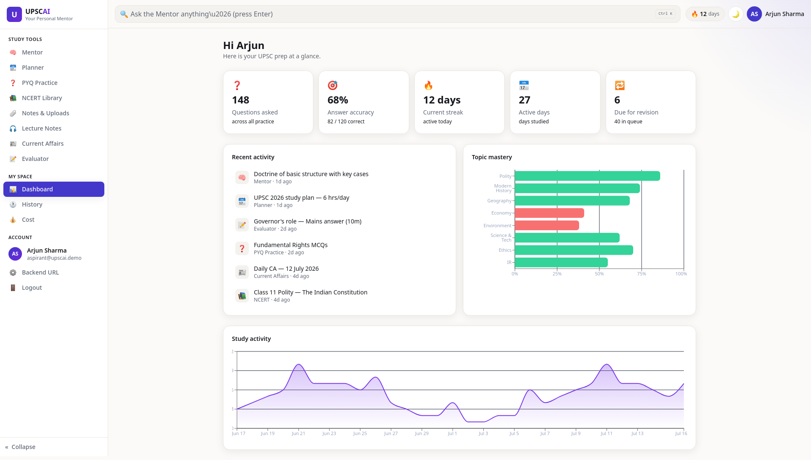

# 🎓 UPSC Agentic AI

### Production-grade, retrieval-grounded AI mentor for UPSC preparation — 8 specialized agents behind one LangGraph supervisor.

<p>
<a href="https://upsc-ai-agentic.vercel.app/"></a>
<a href="https://upsc-agentic-ai-gtsj.onrender.com/docs"></a>
<a href="#-license"></a>
</p>

<p>


</p>

<p>


</p>

<sub><i>Grounded answers with citations · streaming · background workers · circuit breakers · distributed rate limiting · LLM-as-judge CI gate — engineered to run on free-tier cloud.</i></sub>

</div>

---

<div align="center">

### ⚡ 60-Second Snapshot

| 🤖 Agents | 🧩 API Routes | 🧪 Tests | 📦 Initial Load | 🔌 Backend | 🎯 RAG Quality Gate |
|:---:|:---:|:---:|:---:|:---:|:---:|
| **8** specialized | **17** modules | **206** offline | **~82 KB** gzip | **15.4k** LOC | **faithfulness ≥ 0.9** |

</div>

---

## 🧠 Tech Stack

<table>
<tr>
<td valign="top" width="33%">

#### 🧠 AI Stack


</td>
<td valign="top" width="33%">

#### ⚙️ Backend


</td>
<td valign="top" width="33%">

#### 🎨 Frontend


</td>
</tr>
<tr>
<td valign="top">

#### ☁️ Infrastructure


</td>
<td valign="top">

#### 📊 Observability


</td>
<td valign="top">

#### 🔐 Quality & CI


</td>
</tr>
</table>

---

## ✨ Features

<table>
<tr>
<td width="25%" align="center">🤖<br><b>Multi-Agent System</b><br><sub>Supervisor routes to 8 sub-agents</sub></td>
<td width="25%" align="center">🔍<br><b>Hybrid RAG</b><br><sub>Dense + lexical, RRF, rerank</sub></td>
<td width="25%" align="center">📡<br><b>Streaming Responses</b><br><sub>Token-by-token SSE</sub></td>
<td width="25%" align="center">🧵<br><b>Grounded + Cited</b><br><sub>Citation enforcement</sub></td>
</tr>
<tr>
<td align="center">⚙️<br><b>Background Workers</b><br><sub>DB-persisted job queue</sub></td>
<td align="center">🔌<br><b>Circuit Breakers</b><br><sub>Fail fast on flaky deps</sub></td>
<td align="center">🚦<br><b>Distributed Rate Limiting</b><br><sub>Redis + in-proc fallback</sub></td>
<td align="center">🧠<br><b>Semantic Cache</b><br><sub>Exact + embedding match</sub></td>
</tr>
<tr>
<td align="center">🔖<br><b>Request Tracing</b><br><sub>Correlation IDs end-to-end</sub></td>
<td align="center">📝<br><b>Structured Logging</b><br><sub>Request-scoped context</sub></td>
<td align="center">🔀<br><b>Provider Fallback</b><br><sub>Gemini → Groq on 429</sub></td>
<td align="center">🎚️<br><b>Smart Model Routing</b><br><sub>LITE / STRONG per turn</sub></td>
</tr>
</table>

<div align="center">

**Product surface:** Mentor Chat · NCERT RAG · PDF Upload RAG · PYQ Generator · Study Planner · Answer Evaluator · Current Affairs · History & Session Restore

</div>

---

## 🏗️ Architecture

<details open>
<summary><b>System Design — end to end</b></summary>

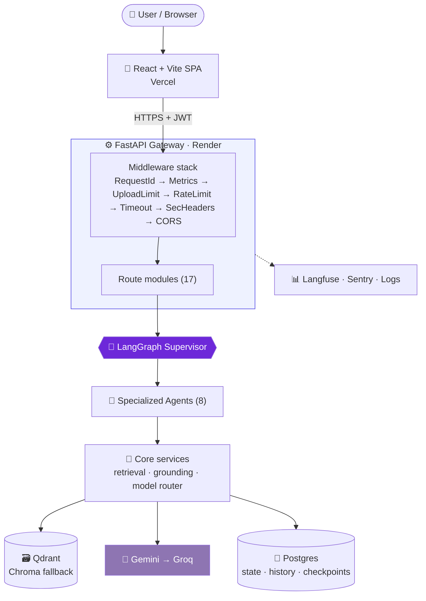
```mermaid
flowchart TD
    U([👤 User / Browser]) --> FE["🎨 React + Vite SPA<br/>Vercel"]
    FE -->|HTTPS + JWT| MW
    subgraph API["⚙️ FastAPI Gateway · Render"]
      MW["Middleware stack<br/>RequestId → Metrics → UploadLimit → RateLimit → Timeout → SecHeaders → CORS"] --> RT["Route modules (17)"]
    end
    RT --> SUP{{"🧠 LangGraph Supervisor"}}
    SUP --> AG["🤖 Specialized Agents (8)"]
    AG --> CORE["🔧 Core services<br/>retrieval · grounding · model router"]
    CORE --> VDB[("🗃️ Qdrant<br/>Chroma fallback")]
    CORE --> LLM["🧠 Gemini → Groq"]
    CORE --> PG[("🐘 Postgres<br/>state · history · checkpoints")]
    API -.-> OBS["📊 Langfuse · Sentry · Logs"]
    style SUP fill:#6D28D9,color:#fff
    style API fill:#EEF2FF,stroke:#4F46E5
    style LLM fill:#8E75B2,color:#fff
```

</details>

<details>
<summary><b>Request Flow</b></summary>

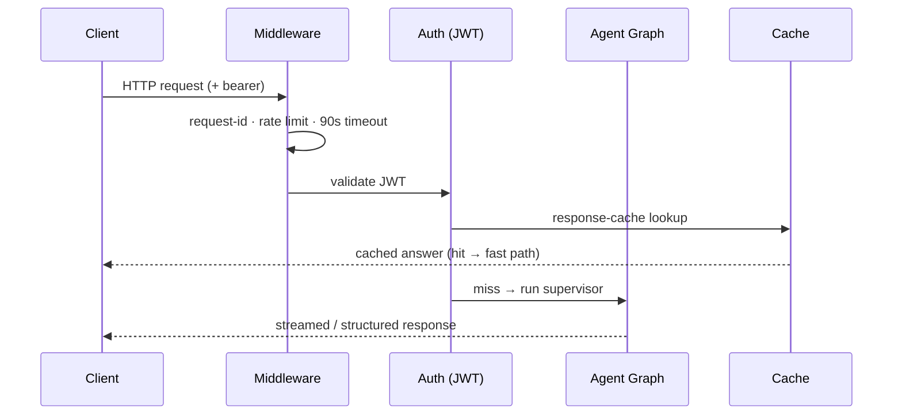
```mermaid
sequenceDiagram
    participant C as Client
    participant M as Middleware
    participant A as Auth (JWT)
    participant G as Agent Graph
    participant K as Cache
    C->>M: HTTP request (+ bearer)
    M->>M: request-id · rate limit · 90s timeout
    M->>A: validate JWT
    A->>K: response-cache lookup
    K-->>C: cached answer (hit → fast path)
    A->>G: miss → run supervisor
    G-->>C: streamed / structured response
```

</details>

<details>
<summary><b>Agent Routing</b></summary>

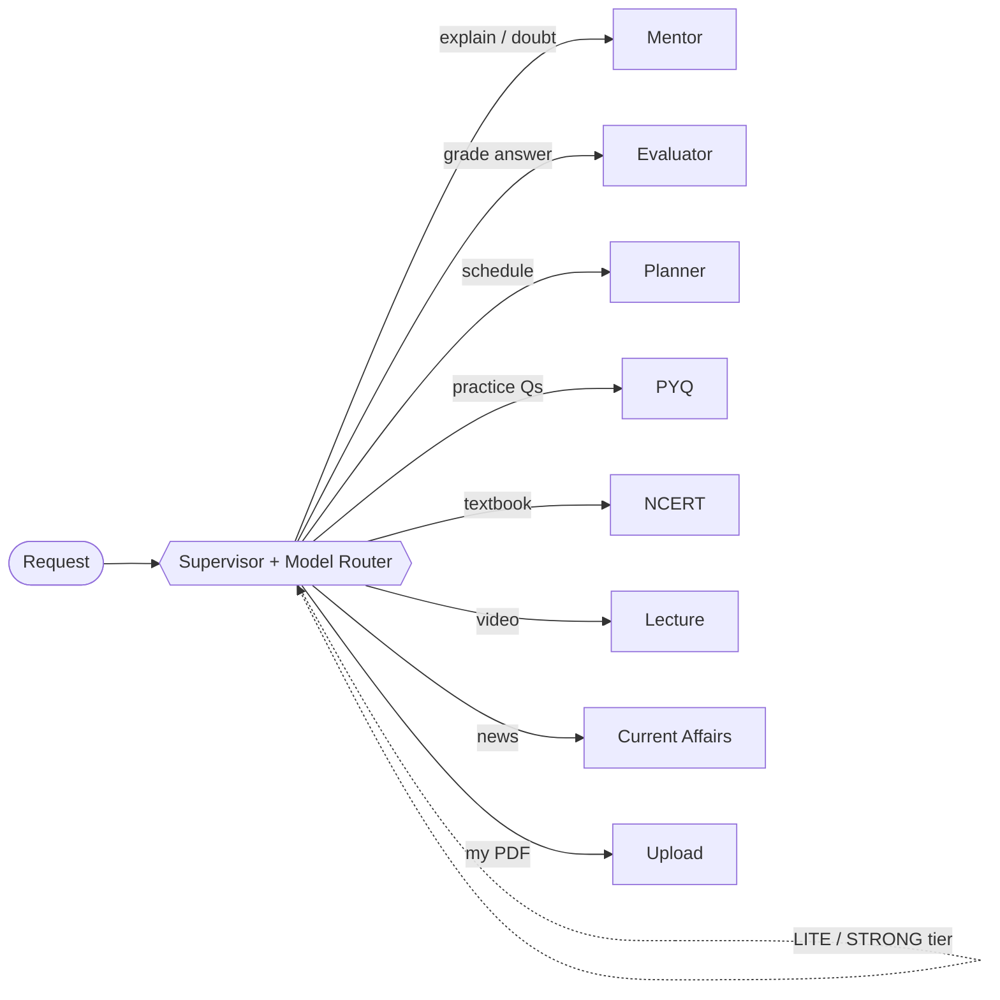
```mermaid
flowchart LR
    Q([Request]) --> R{{Supervisor + Model Router}}
    R -->|explain / doubt| Mentor
    R -->|grade answer| Evaluator
    R -->|schedule| Planner
    R -->|practice Qs| PYQ
    R -->|textbook| NCERT
    R -->|video| Lecture
    R -->|news| CurrentAffairs[Current Affairs]
    R -->|my PDF| Upload
    R -.LITE / STRONG tier.-> R
```

</details>

<details>
<summary><b>RAG Pipeline</b></summary>

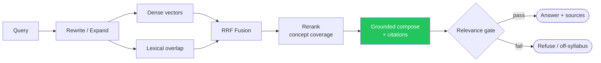
```mermaid
flowchart LR
    A[Query] --> B[Rewrite / Expand]
    B --> C[Dense vectors]
    B --> D[Lexical overlap]
    C --> E[RRF Fusion]
    D --> E
    E --> F[Rerank<br/>concept coverage]
    F --> G[Grounded compose<br/>+ citations]
    G --> H{Relevance gate}
    H -->|pass| I([Answer + sources])
    H -->|fail| J([Refuse / off-syllabus])
    style G fill:#22C55E,color:#fff
```

</details>

<details>
<summary><b>Background Jobs</b></summary>

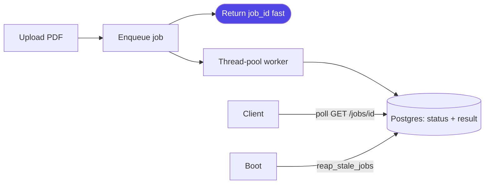
```mermaid
flowchart LR
    U[Upload PDF] --> E[Enqueue job] --> R([Return job_id fast])
    E --> W[Thread-pool worker]
    W --> P[(Postgres: status + result)]
    C[Client] -->|poll GET /jobs/id| P
    B[Boot] -->|reap_stale_jobs| P
    style R fill:#4F46E5,color:#fff
```

</details>

<details>
<summary><b>Deployment Architecture</b></summary>

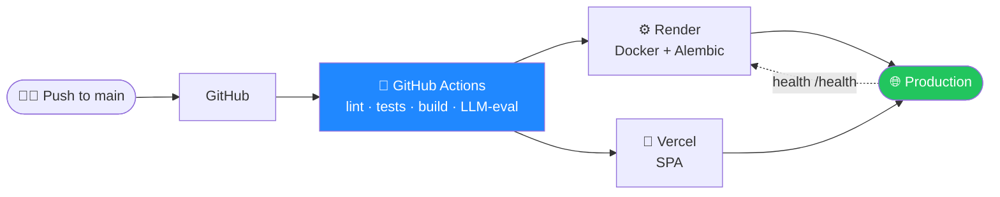
```mermaid
flowchart LR
    Dev([👨‍💻 Push to main]) --> GH[GitHub]
    GH --> CI["🧪 GitHub Actions<br/>lint · tests · build · LLM-eval"]
    CI --> R["⚙️ Render<br/>Docker + Alembic"]
    CI --> V["🎨 Vercel<br/>SPA"]
    R --> Prod([🌐 Production])
    V --> Prod
    Prod -.health /health.-> R
    style CI fill:#2088FF,color:#fff
    style Prod fill:#22C55E,color:#fff
```

</details>

---

## 📊 Production Metrics

<div align="center">

|  |  |  |
|:---:|:---:|:---:|
|  |  |  |

</div>

> 📏 **Measured, reproducible numbers only.** Initial load = entry JS+CSS from `frontend/dist` (244 KB raw ≈ 82 KB gzip); heaviest lazy chunk (charts) is route-split. Backend cold-start/latency depend on Render's free tier (sleeps on idle) and are intentionally **not** asserted — the response cache + LITE/STRONG routing exist to keep the warm path fast.

---

## 🧩 System Design

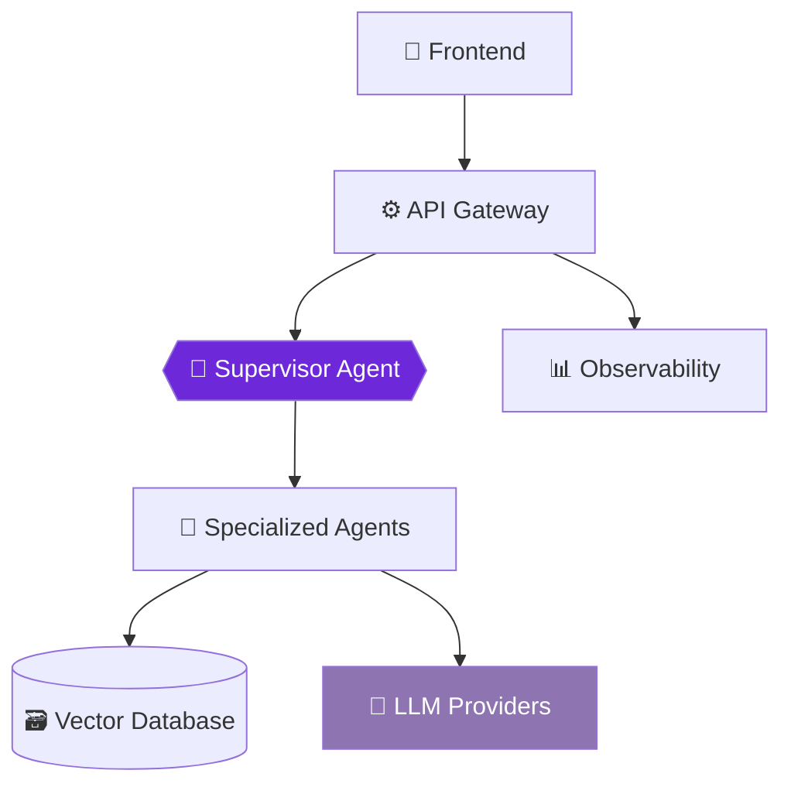
```mermaid
flowchart TD
    A[🎨 Frontend] --> B[⚙️ API Gateway]
    B --> C{{🧠 Supervisor Agent}}
    C --> D[🤖 Specialized Agents]
    D --> E[(🗃️ Vector Database)]
    D --> F[🔌 LLM Providers]
    B --> G[📊 Observability]
    style C fill:#6D28D9,color:#fff
    style F fill:#8E75B2,color:#fff
```

---

## 🧩 Engineering Challenges

| 🪯 Problem | ✅ Solution | ⚖️ Tradeoff |
|---|---|---|
| LLMs hallucinate facts | Hybrid RAG + RRF + rerank + **citation enforcement** | More retrieval latency per answer |
| Free-tier single worker can stall | **90s hard timeout** + circuit breaker on upstreams | Rare aggressive cutoffs under load |
| Long PDF processing blocks requests | **DB-persisted background job queue** | Eventual, poll-based UX |
| Provider 429 / outages | **Gemini → Groq fallback** | Occasional style drift between models |
| Repeated / retried questions cost money | **Two-stage semantic cache** (exact + embedding) | Cache-scope correctness complexity |
| Cost vs. quality per turn | **LITE / STRONG model router** (biased to STRONG) | Slightly higher spend when unsure |
| Rate limiting across instances | **Upstash Redis** window + in-proc fallback | Approximate limits during fallback |
| Silent quality regressions | **LLM-as-judge gate** in CI (≥0.9) | Nightly eval consumes API quota |

---

## 🖼️ Screenshots

<table>
<tr>
<td width="33%"><div align="center"><sub><b>Dashboard</b></sub></div></td>
<td width="33%">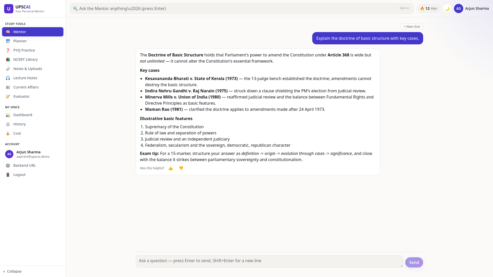<div align="center"><sub><b>Mentor Chat</b></sub></div></td>
<td width="33%">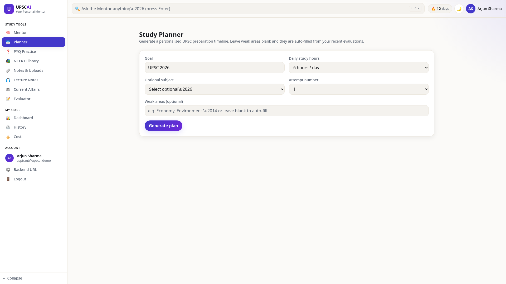<div align="center"><sub><b>Planner</b></sub></div></td>
</tr>
<tr>
<td width="33%">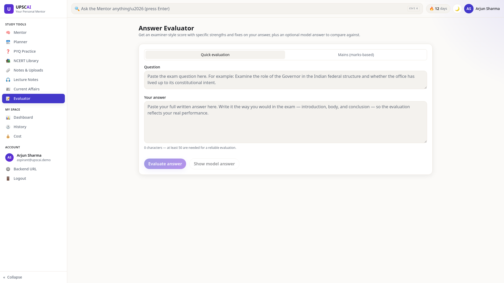<div align="center"><sub><b>Evaluator</b></sub></div></td>
<td width="33%">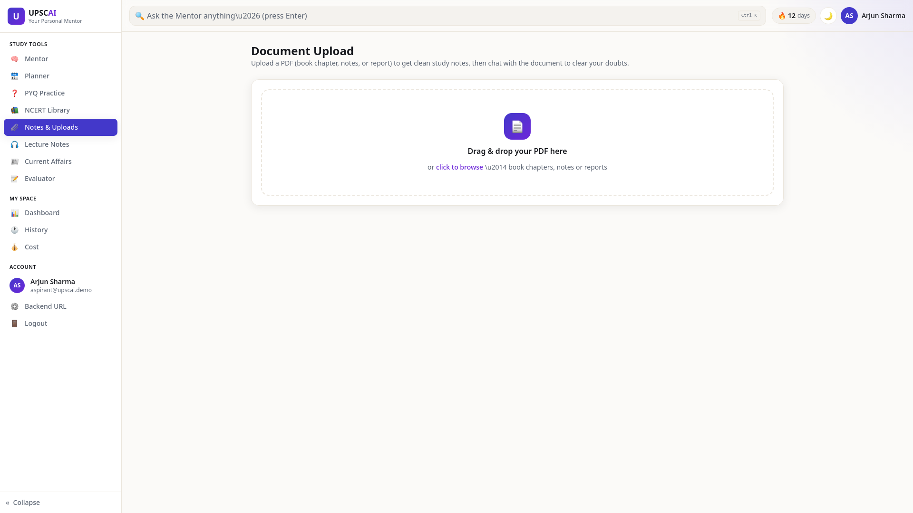<div align="center"><sub><b>RAG Upload</b></sub></div></td>
<td width="33%">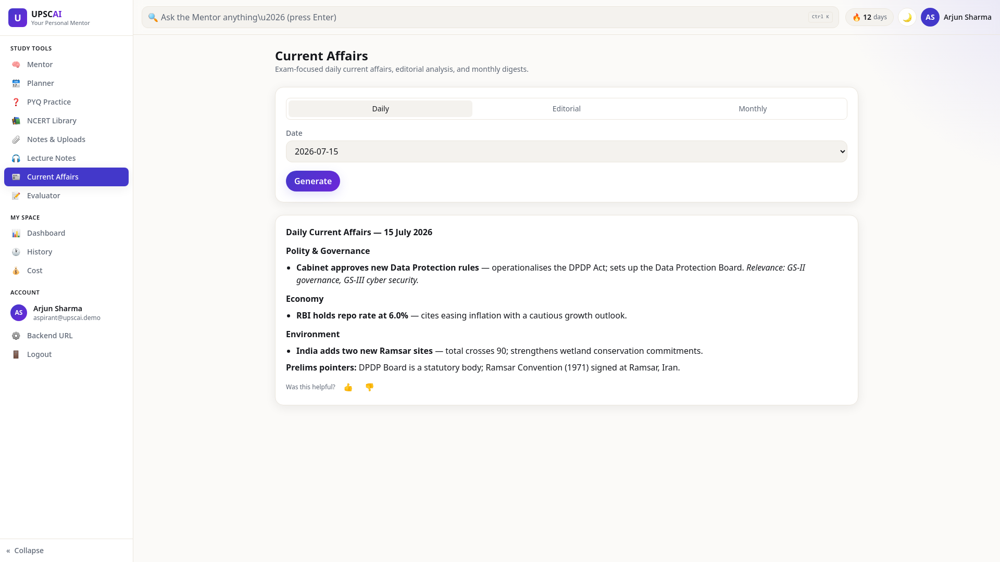<div align="center"><sub><b>Current Affairs</b></sub></div></td>
</tr>
</table>

<div align="center"><sub>🌙 Full light + dark gallery (60 shots) in <a href="./screenshots/README_SCREENSHOTS.md">screenshots/README_SCREENSHOTS.md</a></sub></div>

---

## 🚀 Deployment

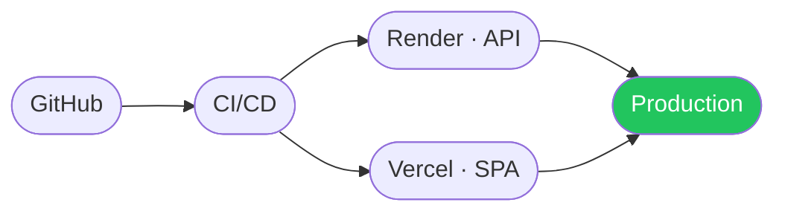
```mermaid
flowchart LR
    A([GitHub]) --> B([CI/CD]) --> C([Render · API]) --> E([Production])
    B --> D([Vercel · SPA]) --> E
    style E fill:#22C55E,color:#fff
```

<table>
<tr><th>Target</th><th>Build</th><th>Start / Serve</th></tr>
<tr><td>⚙️ <b>Render</b> (API)</td><td><code>pip install uv && uv sync --frozen</code></td><td><code>alembic upgrade head && uvicorn src.api.main:app</code></td></tr>
<tr><td>🎨 <b>Vercel</b> (SPA)</td><td><code>npm run build</code></td><td><code>dist/</code> + SPA rewrites</td></tr>
<tr><td>🐳 <b>Docker / HF</b></td><td>multi-stage, non-root</td><td>port <code>7860</code>, healthcheck <code>/health</code></td></tr>
</table>

<details>
<summary><b>⚡ Run locally in 4 commands</b></summary>

```bash
git clone https://github.com/<your-username>/upsc-agentic-ai.git && cd upsc-agentic-ai
uv sync --frozen && cp .env.example .env      # set JWT_SECRET + GOOGLE_API_KEY
uv run alembic upgrade head
uv run uvicorn src.api.main:app --reload      # → http://localhost:8000/docs
```
> Only `JWT_SECRET` + `GOOGLE_API_KEY` are required to boot. Postgres, Qdrant, Redis, Langfuse, Sentry all **fail open** to local/no-op fallbacks.

</details>

---

## 🎛️ Resume Value — Skills Matrix

<div align="center">

| Skill | Demonstrated | Evidence |
|---|:---:|---|
| **Agentic AI** | ✅ | Supervisor + 8 sub-agent graphs |
| **LangGraph** | ✅ | Subgraphs, checkpointer, shared state |
| **RAG** | ✅ | Hybrid + RRF + rerank + citations |
| **FastAPI** | ✅ | 17 route modules, DI auth, streaming + structured |
| **System Design** | ✅ | Circuit breaker, job queue, rate limiting, cache |
| **Observability** | ✅ | Tracing, Langfuse, Sentry, metrics dashboard |
| **DevOps** | ✅ | Docker, uv, Render Blueprint, GitHub Actions |
| **Quality Eng.** | ✅ | 206 offline tests + LLM-as-judge CI gate |

</div>

---

## 📜 License

<b>MIT</b> recommended (permissive, recruiter-friendly). Add a `LICENSE` file: `MIT License — Copyright (c) 2026 Vishal Shivhare`. Prefer an explicit patent grant? Use **Apache-2.0**.

---

<div align="center">

### 👤 Author

**Vishal Shivhare** — GenAI / Backend Engineer

<a href="https://github.com/"></a>
<a href="https://www.linkedin.com/"></a>
<a href="https://example.com"></a>

<sub>Replace the placeholder links above with your live profiles.</sub>

<br><br>
<sub>⭐ If this project is useful or inspiring, consider starring the repo.</sub>

</div>
