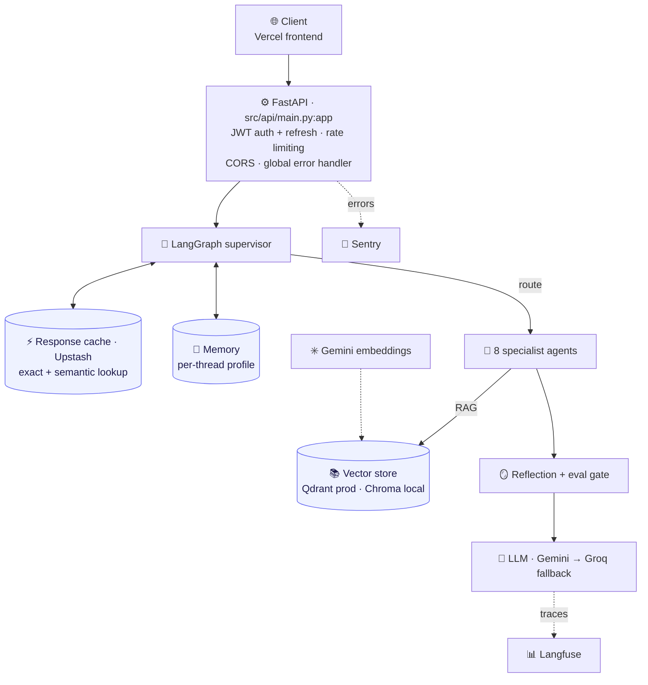

<div align="center">

# UPSC AI Pro 🎓

**An agentic, retrieval-grounded AI study platform for UPSC Civil Services aspirants.**

8 specialised agents · a RAG knowledge core · a production observability stack — built to be *cheap to run* (free-tier cloud + 8 GB dev box) and *honest* (every answer is grounded and evaluated).

### 🌐 [Live App](https://upsc-ai-agentic.vercel.app/)  ·  ⚙️ [API](https://upsc-agentic-ai-gtsj.onrender.com/)  ·  📖 [API Docs](https://upsc-agentic-ai-gtsj.onrender.com/docs)  ·  ❤️ [Health](https://upsc-agentic-ai-gtsj.onrender.com/health)

</div>

---

## 📑 Table of Contents

- [Why this exists](#-why-this-exists)
- [What it does](#-what-it-does)
- [The 8 agents](#-the-8-agents)
- [Architecture](#️-architecture)
- [How the RAG pipeline works](#-how-the-rag-pipeline-works)
- [Reliability & AI-quality layers](#️-reliability--ai-quality-layers)
- [Tech stack](#-tech-stack)
- [Project structure](#-project-structure)
- [Quickstart (local)](#-quickstart-local)
- [Environment variables](#-environment-variables)
- [Testing](#-testing)
- [Deployment](#️-deployment)
- [Observability](#-observability)
- [MCP server](#-mcp-server)
- [CI/CD](#-cicd)
- [Roadmap](#️-roadmap)
- [License](#-license)

---

## 🎯 Why this exists

UPSC preparation drowns aspirants in scattered material — NCERTs, current affairs, past papers, and Mains answer practice with no fast feedback. **UPSC AI Pro** puts all of that behind one tutor that answers *with sources*, evaluates Mains answers like a real examiner, and runs on **free-tier infrastructure** so it stays sustainable.

> The **Mains answer-evaluation loop** (LLM-as-judge, rubric-scored, faithfulness-gated) is the product's moat — it's the hardest thing to get right and the most valuable to an aspirant.

---

## ✨ What it does

A LangGraph **supervisor** routes each question to the right specialist agent. The agent retrieves grounded context (NCERT / current affairs / past papers), answers **with citations**, self-critiques via a reflection pass, and — for Mains — is scored by an LLM-as-judge behind a faithfulness gate.

```text
"Explain Article 21 with case laws"  →  supervisor  →  mentor + RAG  →  grounded answer + citations
"Evaluate my answer on federalism"   →  supervisor  →  evaluator     →  rubric score + feedback
"Make me a 30-day History plan"      →  supervisor  →  planner       →  plan-and-execute timeline
```

---

## 🤖 The 8 agents

| Agent | Role |
|-------|------|
| **mentor** | General doubt-solving, concept explanations, study strategy |
| **planner** | Personalised study timelines via plan-and-execute |
| **ncert** | Grounded Q&A over NCERT textbooks (RAG) |
| **lecture** | Lecture / YouTube summarisation + relevance gating |
| **current_affairs** | Fresh current-affairs synthesis with sources |
| **pyq** | Previous-year-question parsing and practice |
| **evaluator** | Mains answer evaluation (LLM-as-judge, rubric-scored) |
| **upload** | User PDF ingestion → chunk → embed → queryable |

---

## 🏗️ Architecture


```mermaid
flowchart TD
    Client["🌐 Client<br/>Vercel frontend"] --> API["⚙️ FastAPI · src/api/main.py:app<br/>JWT auth + refresh · rate limiting<br/>CORS · global error handler"]

    API --> SUP["🧭 LangGraph supervisor"]
    SUP <--> Cache[("⚡ Response cache · Upstash<br/>exact + semantic lookup")]
    SUP <--> Mem[("🧠 Memory<br/>per-thread profile")]

    SUP -->|route| Agents["🤖 8 specialist agents"]
    Agents -->|RAG| VS[("📚 Vector store<br/>Qdrant prod · Chroma local")]
    Emb["✳️ Gemini embeddings"] -.-> VS

    Agents --> Eval["🪞 Reflection + eval gate"]
    Eval --> LLM["🧠 LLM · Gemini → Groq fallback"]

    LLM -. traces .-> LF["📊 Langfuse"]
    API -. errors .-> Sentry["🚨 Sentry"]

    classDef store fill:#eef2ff,stroke:#6366f1,color:#1e1b4b;
    class Cache,Mem,VS store;
```

<details>
<summary>Text version (for renderers without Mermaid)</summary>

```text
Client (Vercel frontend)
        |
        v
FastAPI (src/api/main.py:app)   - JWT auth + refresh  - rate limiting  - CORS  - errors -> Sentry
        |
        v
LangGraph supervisor  <->  Response cache (Upstash: exact + semantic)
        |             <->  Memory (per-thread profile)
        | route
        v
8 specialist agents  --RAG-->  Vector store (Qdrant / Chroma)  <--  Gemini embeddings
        |
        v
Reflection + eval gate
        |
        v
LLM: Gemini -> Groq fallback
        |    traces -> Langfuse
             errors -> Sentry
```

</details>

---

## 🔎 How the RAG pipeline works

1. **Hybrid retrieval** — a lexical arm (with query rewriting) **plus** a dense arm (Gemini embeddings).
2. **Fusion** — both arms are merged with **Reciprocal Rank Fusion (RRF)**.
3. **Rerank** *(optional)* — the fused set is reranked for final relevance. Default provider is a local `sentence-transformers` CrossEncoder; Cohere Rerank is supported when `COHERE_API_KEY` is set. Both are lazy/optional — retrieval still works without them.
4. **Groundedness gate** — a similarity threshold drops weak chunks; the answer carries **citations** back to its sources.
5. **Backend** — Qdrant (managed) when `QDRANT_URL` is set (production default), else on-disk **Chroma** for local dev.

---

## 🛡️ Reliability & AI-quality layers

| Layer | What it buys you |
|-------|------------------|
| **Reflection / self-critique** | The model reviews its own draft before returning it |
| **Plan-and-execute** | Robust multi-step reasoning for planning tasks |
| **LLM-as-judge eval** | Nightly faithfulness gate (strict, multi-metric, per-agent) |
| **Retrieval eval** | Separate retrieval-quality report (precision / relevancy) |
| **Response cache** | Exact **and** opt-in **semantic** (embedding-similarity) reuse |
| **Admin dashboards** | In-app Cost, Monitoring & Experiments views (admin-only, live metrics) |
| **Fail-open everywhere** | Cache / tracing / monitoring never break a request |

---

## 🧰 Tech stack

| Layer | Choice |
|-------|--------|
| Frontend | React + Vite + Tailwind, deployed on **Vercel** ([upsc-ai-agentic.vercel.app](https://upsc-ai-agentic.vercel.app/)) |
| API | FastAPI + Uvicorn |
| Agents / orchestration | LangGraph + LangChain |
| LLMs | Google Gemini (primary) → Groq (fallback) |
| Embeddings | `models/gemini-embedding-001` |
| Vector DB | Qdrant (managed, prod) / Chroma (local dev) |
| Relational DB | Postgres (Supabase) / SQLite (tests) |
| Migrations | Alembic |
| Cache | Upstash Redis (REST) |
| Observability | Langfuse (tracing) + Sentry (errors) |
| Auth | JWT access + refresh; email verification (SMTP-gated, off by default) |
| Integrations | MCP server (stdio + streamable HTTP) |
| Tooling | `uv`, pytest, GitHub Actions CI |
| Hosting | Render (API, free tier) + Vercel (frontend) |

---

## 📁 Project structure

```text
src/
  api/
    main.py            # FastAPI app factory + lifespan (entrypoint: app)
    routes/            # auth, chat, mentor, planner, ncert, lecture,
                       # current_affairs, pyq, evaluator, upload, history,
                       # feedback, cost, monitoring, experiments, progress
  agents/              # one package per specialist agent (graphs + prompts)
  graph/               # supervisor, rag_graph, state, profile, tools, reflection
  core/
    config.py          # pydantic-settings (all env config)
    vector_store.py    # embeddings + Qdrant/Chroma backend
    retrieval.py       # hybrid retrieval, query rewrite, rerank
    response_cache.py  # Upstash exact + semantic cache
    observability.py   # Langfuse wiring
    error_monitoring.py# Sentry wiring
    security.py, db.py, email_utils.py, rate_limit.py, ...
  eval/                # llm_eval, retrieval_eval, gates
  models/              # ORM + pydantic schemas
  mcp_server.py        # MCP tool server (stdio + HTTP)
tests/                 # 29 test files, offline by default
frontend/              # React + Vite web client (deployed to Vercel)
migrations/            # Alembic
render.yaml            # Render blueprint
.github/workflows/ci.yml
```

---

## 🚀 Quickstart (local)

**Prereqs:** Python 3.13, [`uv`](https://docs.astral.sh/uv/).

```bash
git clone https://github.com/Vishal-AI-ML/upsc-agentic-ai.git
cd upsc-agentic-ai

uv sync                       # install deps from uv.lock
# create a .env in the repo root and fill in the values below
uv run alembic upgrade head   # create DB tables
uv run uvicorn src.api.main:app --reload
```

Open [http://localhost:8000/docs](http://localhost:8000/docs).

**Frontend (optional, local):**

```bash
cd frontend
npm install
npm run dev                   # Vite dev server on http://localhost:5173
```

Set `VITE_API_BASE=http://localhost:8000/api/v1` in `frontend/.env` to point the client at your local API.

---

## 🔑 Environment variables

### Core (required)

| Key | Notes |
|-----|-------|
| `GOOGLE_API_KEY` | Gemini LLM + embeddings |
| `DATABASE_URL` | Postgres (Supabase) in prod; SQLite locally |
| `JWT_SECRET` | Strong random string — **boot fails in prod if weak** |
| `DEBUG` | Must be `false` in prod (or set `ENV=production`) |
| `CORS_ORIGINS` | Comma-separated; include your Vercel origin, e.g. `https://upsc-ai-agentic.vercel.app` |

### Optional — models & retrieval

| Key | Notes |
|-----|-------|
| `GROQ_API_KEY` | Fallback LLM on Gemini 429s (`ENABLE_PROVIDER_FALLBACK=true`) |
| `QDRANT_URL` / `QDRANT_API_KEY` | Enables managed Qdrant; else local Chroma |
| `TAVILY_API_KEY` | Web search for current affairs |
| `COHERE_API_KEY` | Optional Cohere reranker (`RERANK_PROVIDER=cohere`) |
| `SIMILARITY_THRESHOLD` / `MENTOR_KB_THRESHOLD` | Groundedness cut-offs (defaults `0.3` / `0.25`) |

### Optional — auth / email

| Key | Notes |
|-----|-------|
| `REQUIRE_EMAIL_VERIFICATION` | `false` by default in prod; when `true`, verification is only enforced if SMTP is configured |
| `SMTP_HOST` / `SMTP_USER` / `SMTP_PASSWORD` | Enable real email verification / password reset |
| `FRONTEND_URL` | Used to build verification / reset links |

### Optional — response cache (Upstash)

| Key | Notes |
|-----|-------|
| `RESPONSE_CACHE_ENABLED` | Default `false`; set `true` to turn on |
| `UPSTASH_REDIS_REST_URL` / `UPSTASH_REDIS_REST_TOKEN` | Upstash creds |
| `RESPONSE_CACHE_SCOPE` | `thread` (default) / `user` / `global` |
| `RESPONSE_CACHE_TTL_SECONDS` | Default `86400` (24h) |
| `RESPONSE_CACHE_SEMANTIC` | Default `false`; embedding-similarity fallback |
| `RESPONSE_CACHE_SEMANTIC_THRESHOLD` | Cosine hit threshold, default `0.92` |

### Optional — observability & admin

| Key | Notes |
|-----|-------|
| `LANGFUSE_ENABLED` | Default `true` |
| `LANGFUSE_PUBLIC_KEY` / `LANGFUSE_SECRET_KEY` | `pk-lf-…` / `sk-lf-…` |
| `LANGFUSE_HOST` | EU `https://cloud.langfuse.com` · US `https://us.cloud.langfuse.com` (must match signup region) |
| `SENTRY_DSN` | Enables Sentry error capture |
| `SENTRY_ENVIRONMENT` | e.g. `production` |
| `SENTRY_TRACES_SAMPLE_RATE` | Default `0.0` |
| `ADMIN_EMAILS` | JSON list of admin emails, e.g. `["you@example.com"]` — unlocks the in-app Cost / Monitoring / Experiments dashboards |

> ⚠️ **Never commit real secrets.** Rotate any credential that has ever been shared in plaintext.

---

## 🧪 Testing

```bash
uv run pytest -q                 # full offline suite (no API key needed)
```

- Tests boot the **real** FastAPI app against a throwaway SQLite DB; LLM, email and network calls are mocked → fully offline and deterministic.
- **Live smoke test** (opt-in, hits the deployed URL, absorbs cold starts):

```bash
LIVE_BASE_URL=https://upsc-agentic-ai-gtsj.onrender.com uv run pytest tests/test_smoke_live.py -q
```

---

## ☁️ Deployment

**API → Render** (managed by the `render.yaml` blueprint, **free** plan, region `singapore`, Python `3.13`). Start command:

```bash
uv run alembic upgrade head && uv run uvicorn src.api.main:app --host 0.0.0.0 --port $PORT
```

1. **New → Blueprint** → connect the repo (Render auto-detects `render.yaml`) → **Free** plan.
2. Add the secret env vars (Gemini, Groq, Supabase `DATABASE_URL`, Qdrant, `JWT_SECRET`, Tavily, Langfuse, `CORS_ORIGINS`, and optionally Upstash / Sentry / `ADMIN_EMAILS`).
3. Deploy → verify the boot logs and hit `/health`.
4. **Keep-alive:** free instances sleep after ~15 min idle (~1 min cold start). A [cron-job.org](https://cron-job.org/) job pings `/health` every 10 minutes (`*/10 * * * *`) to keep it warm.

> **No persistent disk needed** — embeddings live in managed Qdrant and all user/auth/history data is in Supabase Postgres, so the service is stateless and free-tier friendly.

**Frontend → Vercel** ([upsc-ai-agentic.vercel.app](https://upsc-ai-agentic.vercel.app/)) — set `VITE_API_BASE=https://upsc-agentic-ai-gtsj.onrender.com/api/v1` and add that Vercel origin to the API's `CORS_ORIGINS`.

---

## 📊 Observability

| Tool | Purpose | Why |
|------|---------|-----|
| **Upstash Redis** | Response cache | Cuts repeat latency + LLM cost; free 256 MB |
| **Langfuse** | LLM tracing / analytics | See every prompt, token, cost, and agent trace |
| **Sentry** | Error monitoring | Real-time crash alerts with stack traces |
| **In-app admin** | Cost / Monitoring / Experiments | Live request metrics, cost estimates and feedback tallies for `ADMIN_EMAILS` users |

All external tools **fail open** — if unconfigured or unreachable, the app runs exactly as before.

---

## 🔌 MCP server

The platform exposes its tools over the **Model Context Protocol** (stdio + streamable HTTP), so external MCP clients can call the UPSC tools directly. Toggle via `MCP_ENABLED` / `MCP_TRANSPORT` / `MCP_HTTP_PATH`.

---

## 🔁 CI/CD

| Trigger | What runs |
|---------|-----------|
| Every push / PR | Offline quality gate — `uv sync --frozen`, `py_compile` of AI modules, full `pytest -q` |
| Nightly (02:00 UTC) / manual | Live **LLM-as-judge** faithfulness gate (`--gate 0.9`, strict multi-metric + per-agent) + retrieval-quality eval (artifacts uploaded) |
| Nightly / manual | **Live deploy smoke test** against `LIVE_BASE_URL` |

---

## 🗺️ Roadmap

Production roadmap #1–#13 — **all shipped & live**:

- [x] Advanced evals + structured outputs
- [x] Retrieval eval
- [x] Security + row-level ownership
- [x] Alembic migrations
- [x] Reflection / self-critique
- [x] Plan-and-execute
- [x] RRF fusion + citations
- [x] MCP server (stdio + HTTP)
- [x] Upstash cache — exact **and** semantic
- [x] Langfuse tracing
- [x] Sentry monitoring
- [x] Render deploy + keep-alive cron
- [x] Live e2e smoke test in CI
- [x] In-app admin dashboards (Cost / Monitoring / Experiments)
- [x] React frontend refresh — light/dark theme + redesigned landing page

**Next up (nice-to-have):** real per-call token/cost tracking feeding the Cost dashboard · distributed rate limiting (Upstash-backed) · SMTP-based email verification enabled in prod · deprecation cleanup.

---

## 📜 License

Proprietary — all rights reserved. *(Update this section if you intend to open-source.)*

<div align="center">

Built with ❤️ for UPSC aspirants.

</div>
